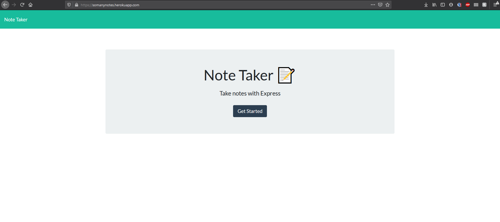

# Note Taking App

## Description 

PROJECT DESCRIPTION

## Table of Contents

* [Installation](#installation)

* [Usage](#usage)

* [License](#license)

* [Contributing](#contributing)

* [Test](#tests)

* [Questions](#questions)

## Installation

To install necesarry dependencies, run the following in your terminal:

npm install

## Usage 

Just a simple repo. The app is currently being deployed on heroku at (https://somanynotes.herokuapp.com/) and the git repo is at (https://github.com/Calmanning/CSM_noteTaker)

## License

This project is licensed under the None license.

## Contributing

Just fork-and-pull if you'd like to contribute.

## Test

Enter the following to run tests on this project:

no tests included.

## Questions

For questions you can reach out to calmanning on GitHub, or email them at calmanning@gmail.com

